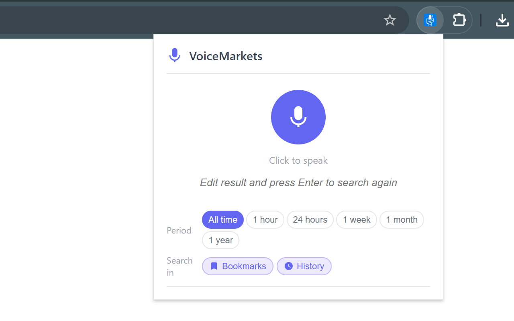

# VoiceMarkets

> 話すだけでブックマーク・履歴を検索。タイピング不要、外部 API 不要。

Voice-navigate your bookmarks and history — no typing, no external API.

[](CHANGELOG.md)
[](LICENSE)
[](https://developer.chrome.com/docs/extensions/mv3/)
[](https://sakamoto66.github.io/voicemarkets/privacy)

---

## デモ



---

## 特徴

- 🎤 **マイクボタン1つ** — クリックして話すだけ。テキスト入力不要
- 🔍 **ブックマーク + 履歴** — 保存済みページと閲覧履歴を横断検索
- 🤖 **Gemini Nano 搭載** — Chrome の組み込み AI によるセマンティックランキング（Stage 2）
- 🌏 **バイリンガル対応** — 日本語・英語のキーワードを自動展開（Translator API）
- 🕒 **期間フィルター** — 1時間 / 24時間 / 1週間 / 1ヶ月 / 1年
- 🔒 **完全ローカル処理** — ブックマーク・履歴データは外部サーバーに送信しない
- ⚡ **AI 非対応でも動作** — キーワード検索にサイレントフォールバック

---

## インストール

### Chrome ウェブストア（推奨）

> 準備中

### 開発者モード（手動）

```bash
# 1. リポジトリをクローン
git clone https://github.com/sakamoto66/voicemarkets.git
cd voicemarkets
```

1. `chrome://extensions/` を開く
2. 右上の **「デベロッパー モード」** を有効にする
3. **「パッケージ化されていない拡張機能を読み込む」** をクリック
4. クローンしたディレクトリを選択
5. ツールバーに VoiceMarkets アイコンが表示されれば完了

---

## 使い方

1. ツールバーの VoiceMarkets アイコンをクリック
2. マイクボタン（🎤）を押して、探したいトピックを話す
3. 結果が表示されたら、クリックしてページへジャンプ

**例:** 「先週見た React のドキュメント」「東京 カフェ」「GitHub actions 使い方」

---

## Gemini Nano（AI ランキング）について

Gemini Nano が利用可能な環境では、キーワード検索（Stage 1）の結果を AI がセマンティックに再ランキング（Stage 2）します。

**確認方法:** 拡張機能のポップアップを開き、ブラウザのコンソールに以下が表示されれば有効です：

```
[VoiceMarkets] Gemini Nano availability: available
```

<details>
<summary>AI ランキングが使えない場合（手動設定）</summary>

1. `chrome://flags/#prompt-api-for-gemini-nano` → **Enabled** に設定
2. `chrome://flags/#optimization-guide-on-device-model` → **Enabled BypassPerfRequirement** に設定
3. Chrome を再起動
4. `chrome://components/` で **Optimization Guide On Device Model** の「アップデートを確認」をクリック
5. バージョンが表示されたら完了（数分かかる場合あり）

> Gemini Nano の提供状況は Chrome のバージョン・チャンネル・デバイスのスペックによって異なります。利用できない環境ではキーワード検索にフォールバックして動作します。

</details>

---

## プライバシー

| データ | 処理場所 |
|--------|---------|
| ブックマーク・履歴 | ブラウザ内のみ（外部送信なし） |
| 音声認識 | Web Speech API 経由（Google サーバー）|
| AI ランキング | Gemini Nano によるオンデバイス処理 |

詳細: [Privacy Policy](https://sakamoto66.github.io/voicemarkets/privacy)

---

## 開発

```bash
npm install
npm test              # Vitest ユニットテスト（52件）
npm run test:watch    # ウォッチモード
npm run test:e2e      # Playwright E2E テスト（ヘッドレス）
npm run test:e2e:ui   # Playwright UI モード（インタラクティブ）
```

> CI 環境では `xvfb-run npm run test:e2e`（Chrome 拡張機能はヘッドレス単体では動作しないため）

---

## アーキテクチャ

```
voicemarkets/
├── manifest.json              # MV3, permissions: bookmarks, history, tabs
├── popup/
│   ├── popup.js               # オーケストレーター: 状態管理・イベント配線
│   ├── voice.js               # Web Speech API (createVoice)
│   ├── ai.js                  # Translator API + Gemini Nano（意図解析・再ランキング）
│   ├── search.js              # 純粋関数: キーワード抽出・スコアリング
│   ├── cache.js               # 起動時ブックマークキャッシュ
│   ├── i18n.js                # t() ラッパー + applyI18n()
│   └── render.js              # DOM ヘルパー
└── background/
    └── service-worker.js      # MV3 サービスワーカー（最小限）
```

**3段階検索パイプライン:**

| Stage | 処理 | 条件 |
|-------|------|------|
| Stage 0 | Gemini Nano で音声候補選択・期間検出・キーワード展開 | AI 利用可能時のみ |
| Stage 1 | キーワード検索 + スコアリング → 上位 20 件 | 常時実行 |
| Stage 2 | Gemini Nano でセマンティック再ランキング → 上位 5 件 | AI 利用可能時のみ |

---

## コントリビューション

PR・Issue 歓迎です。大きな変更は先に Issue で相談してください。

1. フォークしてブランチを作成 (`git checkout -b feature/xxx`)
2. 変更をコミット (`git commit -m 'feat: add xxx'`)
3. ブランチにプッシュ (`git push origin feature/xxx`)
4. Pull Request を作成

---

## ライセンス

[MIT](LICENSE)

---

## English

**VoiceMarkets** is a Chrome MV3 extension that lets you navigate your bookmarks and browser history by voice. Speak a topic — it finds the page you were looking for without typing.

**No external API.** Voice transcription uses the Web Speech API (Google's servers). Semantic re-ranking uses Gemini Nano — fully on-device.

### Why it exists

Every voice browser extension triggers a web search. VoiceMarkets does the opposite: it searches *your own* browsing history and bookmarks. Power users with thousands of bookmarks already have the information — they just can't get back to it fast enough.

### Install

1. Open `chrome://extensions/`
2. Enable **Developer mode** (top right)
3. Click **Load unpacked** and select this directory

### Privacy

Your bookmarks and history never leave the browser. Gemini Nano ranking is fully on-device. Voice transcription routes through Google's Web Speech API — the same as Chrome's built-in speech input. [Privacy Policy](https://sakamoto66.github.io/voicemarkets/privacy)
